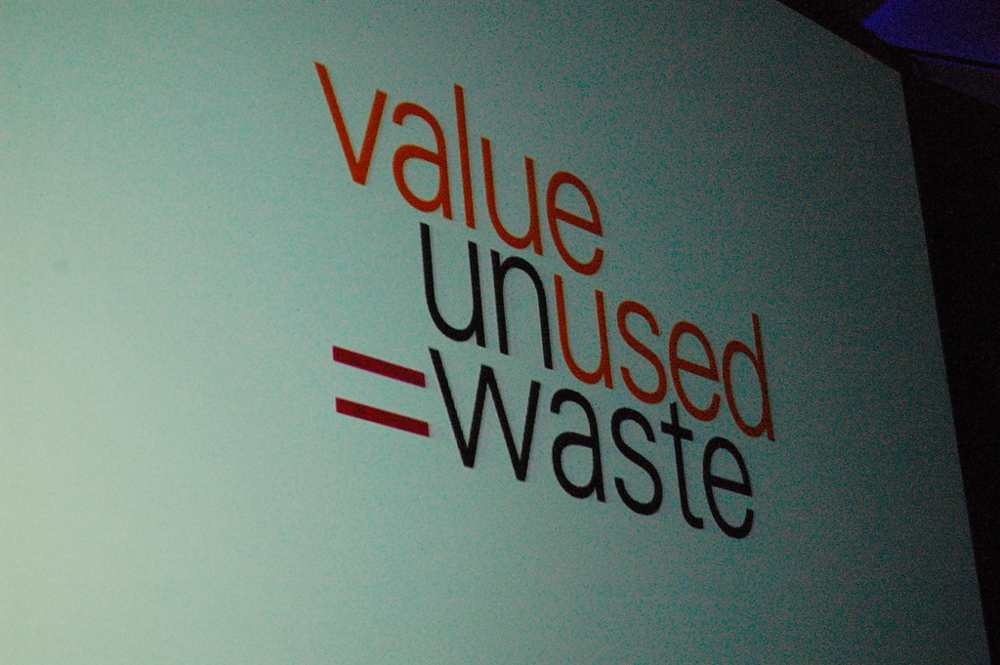

.. include:: <s5defs.txt>

Bilingual Project Docs
======================

.. class:: center

Easily meet requirements with Sphinx & reStructuredText

Why are we talking about this?
------------------------------

:tiny:`"Value Unused = Waste" by Kevin Krejci`

GC Digital Standards
--------------------

* Design with users
* Iterate and improve frequently
* Build in accessibility from the start
* `among others <https://www.canada.ca/en/government/system/digital-government/government-canada-digital-standards.html>`_

GC AI guiding principles
------------------------

From `Responsible use of AI <https://www.canada.ca/en/government/system/digital-government/digital-government-innovations/responsible-use-ai.html#toc1>`_

* understand and measure
* be transparent
* provide meaningful explanations
* be as open as we can
* provide sufficient training

Projects have a lot of documentation
------------------------------------

Documentation is often written by multiple parties working together.

.. class:: tiny borderless

================================================  ================================================
* Attestation checklist for investment proposals  * Project plan
* Business proposal                               * Dashboards
* Corporate Costing Workbook (CCW)                * Transition plan
* Project complexity and risk assessment (PCRA)   * Project close-out report
* Business case
* Project charter
* High level business requirements
================================================  ================================================

:small:`*This is just management documentation - it doesn't even account for technical and user docs!*`

So many options
---------------

There is an abundance of choice

Potential documentation formats and locations
---------------------------------------------

.. class:: borderless

==========================  ==========================
* MS Word/Excel/PowerPoint  * GCDocs project folders
* Plain text                * Net A project folders
* Confluence/wikis          * Project repository
* LaTeX
* XML
* Email
* Power BI
==========================  ==========================

Goal
----

Treat documentation like code, and let CI/CD produce all the required formats.

.. class:: borderless

=================================================  ========================================
* Reviewable content :small:`(prose, equations)`   * Easy to use
* Content focus                                    * Automatable
* Don't require special programs                   * Versioned
* *Translatable* :small:`(with revision control)`  * Build multiple outputs
=================================================  ========================================

We aren't the first to face this problem
----------------------------------------

:tiny:`"Help! 5D Problem" by aturkus`

reStructuredText (reST)
-----------------------

* Lightweight markup language designed to be both
    .. class:: small

    a. processable by documentation-processing software such as Docutils (Python), and
    b. easily readable by human programmers who are reading and writing source code

* reStructuredText is commonly used for technical documentation (even outside Python)
* Suitable for a wide range of texts
* Easy to conver to other formats
    .. class:: small

    - HTML, LaTeX, PDF, Unix man pages, ODT, S5 (slides), XML, others

Sphinx
------

* Handles converting reST into multiple formats
    .. class:: small

    - Also supports other source languages like Markdown
* Auto-generate documentation from source code
* Write mathematical notation
* Manage translations
* Wide adoption among many projects
* Open source, extensible, well maintained

Show don't tell
---------------

Lets see how it works.